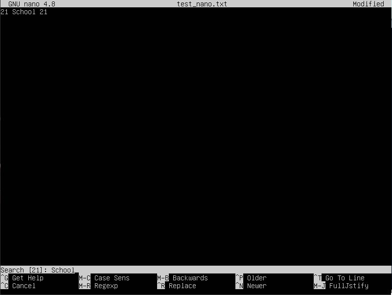
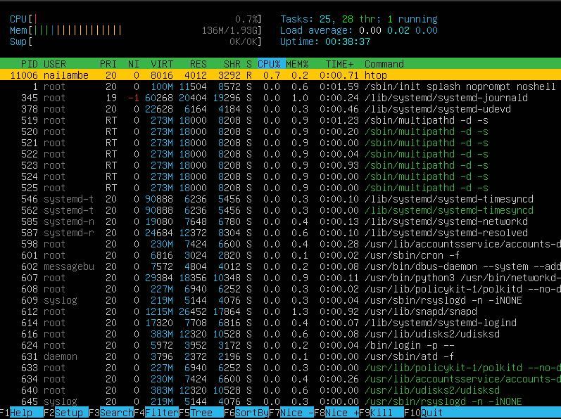
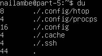

## Part 1. Installation of the OS  
  
*Command and version of OS*  
## Part 2. Creating a user  
* Add user  
    
  *command*  
* group  
    
  *New user and his groups*  
## Part 3. Setting up the OS network  
1. Интерфейс "lo" в выводе команды ip link show представляет собой интерфейс "Loopback" (петлевой интерфейс). Этот интерфейс представляет виртуальное сетевое устройство, которое используется для обмена данными на уровне сетевого стека без фактической передачи данных через физическую сеть.
Наличие интерфейса "lo" на нашем Ubuntu Server абсолютно нормально и ожидаемо. Он создается автоматически при загрузке операционной системы, так как это чрезвычайно важный компонент для работы сетевого стека. 
2. DHCP (англ. Dynamic Host Configuration Protocol — протокол динамической настройки узла) — сетевой протокол, позволяющий сетевым устройствам автоматически получать IP-адрес и другие параметры, необходимые для работы в сети TCP/IP. Данный протокол работает по модели «клиент-сервер».  
3. * Поменял имя: ```sudo vi /etc/hostname```
   * Ребутнул систему командой ```reboot```, чтобы имя окончательно поменялось
   * Поменял часовой пояс с помощью ```timedatectl set-timezone Europe/Moscow```
   * Чтобы посмотреть текущие сетевые интерфейсы ввёл команду ```ip link show```
   * Посмотрел текущий ip который выдал dhcp с помощью ```ip r```
   * Вывел внутренний ip ```ip a``` и внешний ```curl https://ipinfo.io/ip```
   * Изменил файл /etc/netplan/00-installer-config.yaml под статический ip  
     
   *Конфигурация*  
   * И применил настройки командой ```sudo netplan apply```, ребутнул ```reboot```  
4. Пингуем:  
     
   *Пропинговали после применения всех настроек*  
## Part 4. OS Update  
  
*Система обновлена*  
## Part 5. Using the sudo command  
1. Команда sudo в UNIX-подобных системах предназначена для выполнения команд от имени другого пользователя, чаще всего суперпользователя (root), с повышенными привилегиями. Она используется для выполнения операций, требующих административных прав доступа, таких как управление системными настройками, установка программного обеспечения, а также для повышения безопасности за счет ограничения доступа к определенным командам и файлам.  
2. Новый пользователь поменял имя хоста  
  
*пользователь part2 поменял имя хоста*  
## Part 6. Installing and configuring the time service
Часовой пояс  
  
*Служба работает*  
## Part 7. Installing and using text editors
Я установил vim, nano и mcedit  
1. Для записи
   * Vim  
     
   *Нажимаем 'I' чтобы перейти в режим изменения текста, после редактирования нажимаеми ESC и вводим ```:wq```*  
   * Nano  
     
   *После редактирования нажимаем ^X, Y, дальше Enter*  
   * Mcedit  
     
   *После редактирования текста нажимаем на ESC и дальше выбираем Yes*  
2. Для редактирования без изменений  
   * Vim  
     
   *Нажимаем 'I' чтобы перейти в режим изменения текста, после редактирования нажимаеми ESC и вводим ```:q!```*  
   * Nano  
     
   *После редактирования нажимаем ^X, N*  
   * Mcedit  
     
   *После редактирования текста нажимаем на ESC и дальше выбираем No*  
3. Ищем и изменяем слова  
   * Vim search  
     
   *Переходим в режим поиска '/' и вводим что хотим найти*  
   Vim replace  
     
   *В основном режиме пишем ```:s/School/Aboba/``` и нажимаем Enter, чтобы заменить слово*  
   * Nano search  
     
   *^W и вводим искомое*  
   Nano replace  
     
   *^W, ^R, вводим искомое, Enter, вводим на что заменить, Enter, Y*  
   * Mcedit search  
     
   *Нажимаем на f7, вводим искомое, Enter*  
   Mcedit replace  
     
   *Нажимаем на f4, вводим заменяемое и на что заменить, нажимаем Enter, Enter*  
## Part 8. Installing and basic setup of the SSHD service  
1. Устанавливаем ssh-server командой ```sudo apt install openssh-server```  
2. Делаем автозапуск службы ```sudo systemctl enable ssh```  
3. Изменяем порт в файле на 2022 ```sudo vim /etc/ssh/sshd_config```
4. Смотрим на процесс sshd:  
   Команда: ```ps aux | grep sshd```

    * ```ps```: Эта команда используется для отображения текущих процессов.
    * 'aux': Этот набор ключей определяет формат вывода. a показывает процессы всех пользователей, u отображает дополнительную информацию о процессах, x позволяет отображать процессы, не связанные с текущим терминалом.
    * '|': Этот символ, известный как "pipe", используется для передачи вывода одной команды на вход другой команде.
    * ```grep sshd```: Эта часть команды фильтрует вывод ps, отображая только строки, содержащие ключевое слово "sshd", что позволяет нам найти процессы, связанные с SSH сервером.
5. Ребут системы ```reboot```  
6. Запускаем ```netstat -tan```:  
'-tan': Этот набор ключей определяет формат вывода netstat. 't' отображает TCP-подключения, 'a' показывает все активные подключения и порты, 'n' отображает числовые значения IP-адресов и портов вместо их имен.  
  
*Вывод команды ```netstat -tan```*  
   * 'tcp': Это протокол, который используется для данного подключения (в данном случае TCP).
   * '0': Это номер протокола или состояние подключения. В контексте этого вывода, это число обычно означает количество активных соединений с этим состоянием.
   * '0.0.0.0:2022': Это локальный адрес и порт, на котором сервер прослушивает входящие подключения. 0.0.0.0 указывает на то, что сервер прослушивает все доступные сетевые интерфейсы на порту 2022.
   * '0.0.0.0:\*': Это адрес и порт, с которого не было установлено конкретное удаленное подключение. Звездочка (*) означает, что здесь может быть любой удаленный адрес.
   * 'LISTEN': Это состояние подключения, означающее, что сервер ожидает входящих подключений на указанном порту.  
## Part 9. Installing and using the top, htop utilities  
1. top
   * uptime 17 min  
   * number of authorised users  1  
   * total system load  0.10, 0.04, 0.01
   * total number of processes   91
   * cpu load 11% 
   * memory load 134.4
   * pid of the process with the highest memory usage 519
   * pid of the process taking the most CPU time 5
2. htop
   * Sorted by PID  
     
   * Sorted by PERCENT_CPU  
     
   * Sorted by PERCENT_MEM  
   
   * Sorted by TIME  
   
   * filtered for sshd process  
   
   * with the syslog process found by searching  
   
   * with hostname, clock and uptime output  
   
## Part 10. Using the fdisk utility
* Disk /dev/sda: 3Gib, 6291456 sectors  
* Disk model: VBOX HARDDISK  
* Swap size: 0  
## Part 11. Using the df utility
Root partition (/)  
```df``` (in kilobytes):  
* partition size 3018536
* space used 2760380
* space free 84640
* percentage used 98%   

```df -Th```:  
* partition size 2.9G
* space used 2.7G
* space free 83M
* percentage used 98%  

Filesystem type is ext4
## Part 12. Using the du utility  
1. Run the ```du``` command  
     
   *вывод комманды ```du```*  
2. size of the /home, /var, /var/log  
     
   *вывод комманды ```sudo du -sh /home /var/log /var```*  
3. size of all contents in /var/log  
     
   *вывод комманды ```sudo du -sh /var/log/*```*   
## Part 13. Installing and using the ncdu utility  
1. size of /home  - 152K  
     
   *```sudo ncdu /home```*  
2. size of /var  - 744.8M  
     
   *```sudo ncdu /var```*  
3. size of /var/log  - 35.9M  
     
   *```sudo ncdu /var/log```*  
## Part 14. Working with system logs  
1. Последний успешный вход:  
   Время: Mar 29 00:00:17  
   Имя: nailambe  
   Метод: LOGIN
2. Перезапуск SSHd сервиса с помощью команды ```sudo service ssh restart```  
     
   *Терминация сервиса и его восстановление под новым айди в auth.log*  
     
   *Заверешние и запуск сервиса в syslog*  
## Part 15. Using the CRON job scheduler  
1. CRON исполняет uptime каждые 2 минуты  
     
   *```grep "uptime" /var/log/syslog```*  
2. Текущие задачи CRON  
     
   *```crontab -l```*  
3. Удаляем все задачи из CRON  
     
   *```crontab -l```*